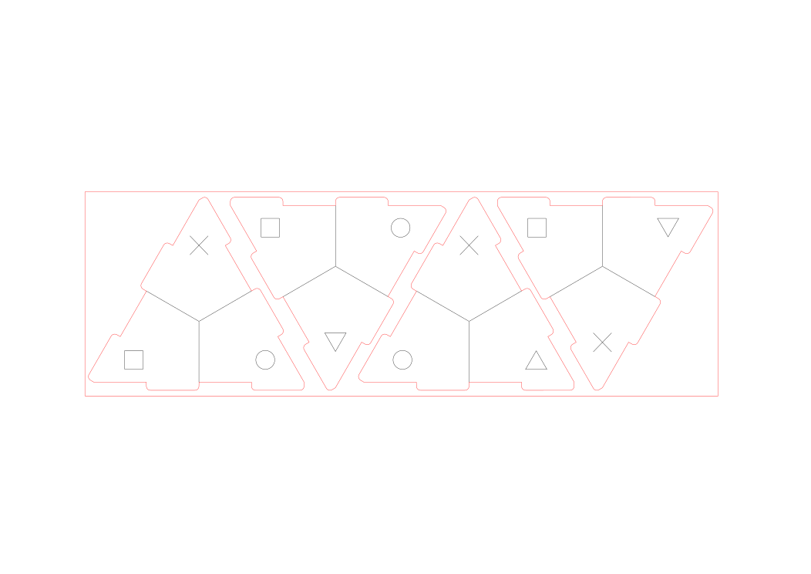

# Fabriquez vos propres Tetra-Aides en medium

## L'histoire du Tetra-Aide

Le Tétra-Aide est une idée originale de [Bruce DEMAUGÉ-BOST](http://bdemauge.free.fr/) professeur des écoles qui a mis en place ce projet dans sa classe afin d'avoir un indicateur visuel efficace pour connaître "l'état" de ses élèves notamment lors de travaux en autonomie (coin vert en haut: tout va bien, coin rouge en haut: j'ai une question urgente ...). Plus d'informations [ici](http://cpe.ac-dijon.fr/spip.php?article737).

Le système semble bien fonctionner mais a l'inconvénient d'être fragile car en papier. Plusieurs personnes ont essayé de produire des modèles plus résistants (impression 3D...), vous en découvrirez certains en tapant le "mot dièze" [#tetraaide](https://twitter.com/hashtag/TetraAide)  sur Twitter.

Comme vous pouvez le voir [PostClass](https://twitter.com/postclass_fr) prépare une version à acheter prète à monter.

On propose ici tout ce qu'il faut pour ceux voulant fabriquer eux-mêmes des Tétra-Aides en MDF.

## Comment fabriquer le tétraèdre ?

Il suffit d'acheter une plaque de medium (MDF) de 3mm d'épaisseur et de trouver un FabLab disposant d'une découpeuse laser (comme le [FabLab de Lannion](http://fablab-lannion.org/)).

Voici [le fichier prêt à la découpe](decoupe/tetra-aide.dxf) (au format DXF), en noir les lignes à graver, en rouge celles à découper. Les "FabManager" vous guideront pour préparer la découpe.

Le MDF 3mm est très peu cher, comptez 11€ la plaque de 1,2m sur 2,4m ... soit de quoi faire 150 Tétra-Aides ! Il faut ajouter comme coût le temps d'utilisation de la machine (5€ le quart d'heure au FabLab de Lannion).

Vous trouverez [ici le fichier source](decoupe/tetra-aide.svg) au format SVG créé avec [Inkscape](https://inkscape.org/fr/) si vous voulez adapter le modèle.

## Comment mettre les couleurs ?

### Peindre les faces

Il suffit d'attribuer à chaque symbole une couleur puis de peindre chaque partie. 

### Découper et coller une impression

Voici plusieurs fichiers que vous pouvez imprimer pour ensuite découper les faces à coller sur le tetraèdre :
- [Une version sans les encoches](impression/sans-bord.pdf) plus simple à découper mais qui ne couvre pas entièrement les faces
- [Une version avec les encoches](impression/avec-bords.pdf) qui donne un meilleur rendu

Ces fichiers peuvent être utilisés pour créer des autocollants (voir avec un imprimeur local ou en utilisant une imprimante puis une découpeuse vinyle)

## Comment fixer les faces ?

L'emboitement n'étant pas parfait, il faut mieux utiliser de la colle pour avoir un tetraèdre solide. Pour cela de la colle liquide blanche standard fera l'affaire.

## Licence

Tous les documents de ce projet sont sous [CC-BY-SA](https://creativecommons.org/licenses/by-sa/2.0/deed.fr).
