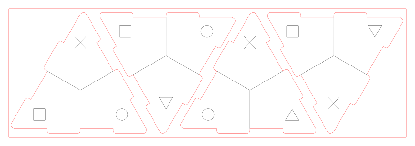

# Fabriquez vos propres Tetra-Aides en medium

Il suffit d'acheter une plaque de medium (MDF) de 3mm d'épaisseur et de trouver un FabLab disposant d'une découpeuse laser.

## Le fichier de découpe

Voici [le fichier près à la découpe](decoupe/tetra-aide.dxf) (au format DXF), en noir les lignes à graver, en rouge celles à découper.

Vous trouverez [ici le fichier source](decoupe/tetra-aide.svg) au format SVG créer avec Inkscape si vous voulez adapter le modèle.

## Comment mettre les couleurs ?

### Peindre les faces

Il suffit d'attribuer à chaque symbole une couleur puis de peindre chaque partie. 

### Découper et coller une impression

Voici plusieurs fichiers que vous pouvez imprimer pour ensuite découper les faces à coller sur le tetraèdre :
- [Une version sans les encoches](impression/sans-bord.pdf) plus simple à découper mais qui ne couvre pas entièrement les faces
- [Une version avec les encoches](impression/avec-bords.pdf) qui donne un meilleur rendu

Ces fichiers peuvent être utilisés pour créer des autocollants (voir avec un imprimeur local ou en utilisant une imprimante puis une découpeuse vinyle)

## Comment fixer les faces ?

L'emboitement n'étant pas parfait, il faut mieux utiliser de la colle pour avoir un tetraèdre solide. Pour cela de la colle liquide blanche standard fera l'affaire.

## Licence

Tous les documents de ce projet sont sous [CC-BY-SA](https://creativecommons.org/licenses/by-sa/2.0/deed.fr).
